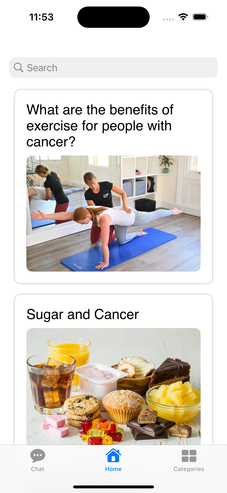
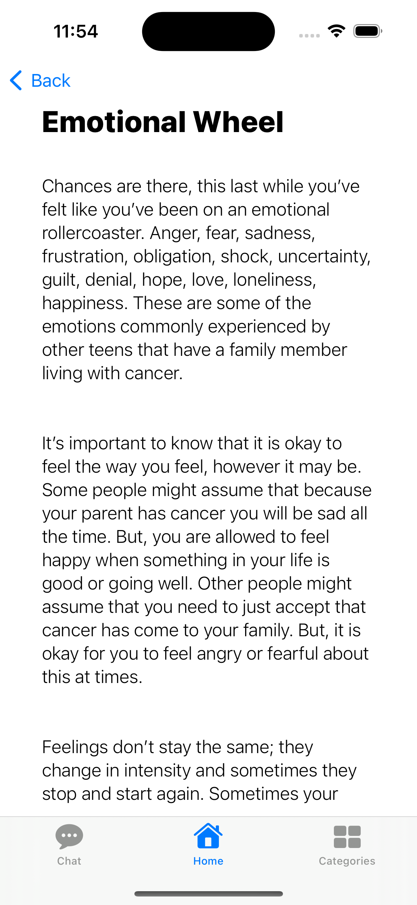
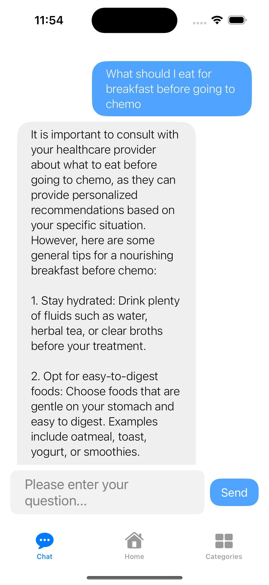
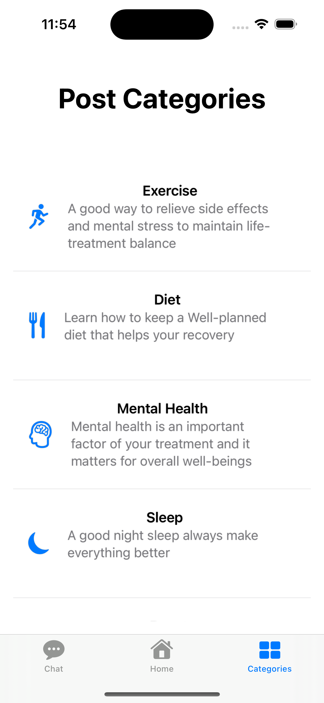
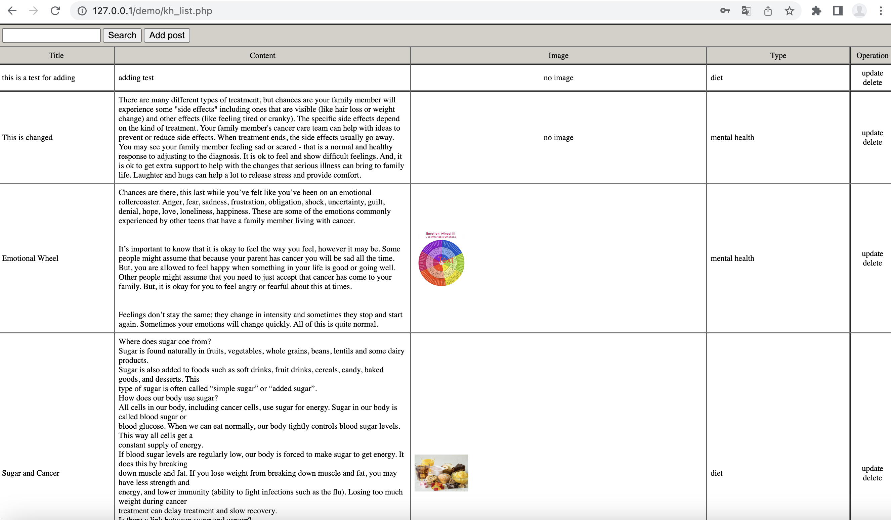
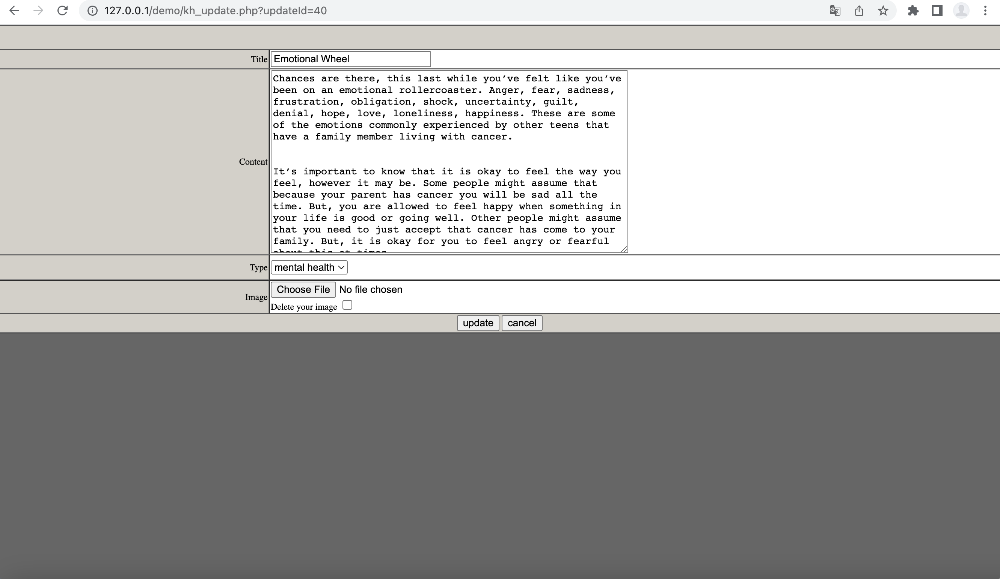

# Chemotherapy Manual App

Welcome to the Chemotherapy Manual App! This application is designed to provide comprehensive information and assistance related to chemotherapy, aimed at both patients and healthcare professionals.

## Features

### 📱 Main Page & Post Page
The main page serves as a hub for accessing articles containing chemotherapy-related health advice and information. Users can browse through a variety of topics, ranging from treatment options to managing side effects. The posts are displayed with proper lining and fonts for best user experience.

### 💬 AI Chat Assistance Page
The AI-powered chatbot provides personalized assistance and immediate responses to questions. While it not being able to serve 100% medical purposes with accurate answers, it does provides some context and help for common questions relating to mental and physical health questions.

### 📚 Category Page
The category page allows users to explore articles grouped by specific categories, making it easier to find information relevant to their needs. Categories may include topics such as chemotherapy drugs, treatment procedures, and lifestyle recommendations during treatment.
<div align="left">
  
  
  
  
</div>

## Backend Management System

### 🖥️ Main Page (Website) & Sample Post
<div align="center">
  
  
</div>
The backend management system provides administrators (post authors) with the ability to delete, add, and edit posts. This ensures the content remains up-to-date and relevant for users. Sample posts featured in the app are sourced from [BC Cancer](http://www.bccancer.bc.ca/).

## Getting Started

To get started with the Chemotherapy Manual App, follow these steps:

1. Clone the repository to your local machine:
   ```bash
   git clone https://github.com/yourusername/chemotherapy-manual-app.git


1. Clone the repository to your local machine:
   ```bash
   git clone https://github.com/TrieYang/chemotherapy-manual-app.git


